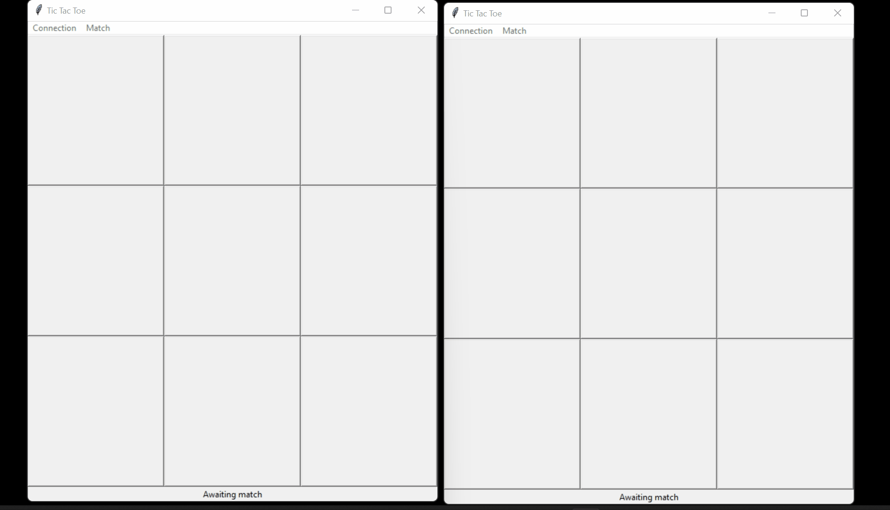

# Exemplo de uso

Para executar um exemplo de uso é necessário ter [instalado o pipenv](https://pipenv.pypa.io/en/latest/install/#pragmatic-installation-of-pipenv). Pipenv é uma ferramenta que cria ambientes virtuais Python para execução de aplicações de forma isolada e simplificada.

## Executando um exemplo

1. Certifique-se de que [pipenv está instalado](https://pipenv.pypa.io/en/latest/install/#pragmatic-installation-of-pipenv):  

1. A partir da pasta sample/, execute `python -m pipenv install` para criar um ambiente Python com as dependências descritas no [Pipfile](./Pipfile) já instaladas:  

1. A partir da pasta sample/, execute `python -m pipenv shell` para iniciar um terminal no contexto do interpretador Python criado no passo anterior. Então, execute `python -m tkinter_sample` para rodar o exemplo:  

1. Repita o passo anterior em outro terminal para executar duas instâncias do jogo, que então poderão conectar-se uma a outra:  

## Modelagem 

Com a biblioteca py-netgames-client, a comunicação entre diferentes instâncias de um jogo é realizada através de duas classes:
1. `PyNetgamesServerProxy`: Utilizada para iniciar e finalizar conexões, solicitar partidas e enviar jogadas.
2. `PyNetgamesServerListener`: Classe abstrata que deve ser implementada e adicionada a um `PyNetgamesServerProxy` através do método `add_listener`. Em suma, é responsável pelo recebimento de partidas, jogadas e confirmações de ações assíncronas.
    - Um exemplo de ação assíncrona a ser confirmada é a conexão. Uma conexão é solicitada através do método `PyNetgamesServerProxy.send_connect`. Quando constatada, são notificadas as instâncias de `PyNetgamesServerListener` através do método `receive_connection_success`.

## Uso com IDEs

Para que IDEs visualizem corretamente a instalação de dependências realizadas dentro de um ambiente Pipenv, é necessário apontar para o interpretador correto, aquele criado pelo pipenv `pipenv install`.

-  No caso do VSCode isso pode ser feito, após a instalação do plugin de Python, através do fluxo [Select Interpreter](https://code.visualstudio.com/docs/python/environments#_select-and-activate-an-environment)
- No caso do PyCharm, através do [Setting an existing Python interpreter](https://www.jetbrains.com/help/pycharm/configuring-python-interpreter.html#add-existing-interpreter)

